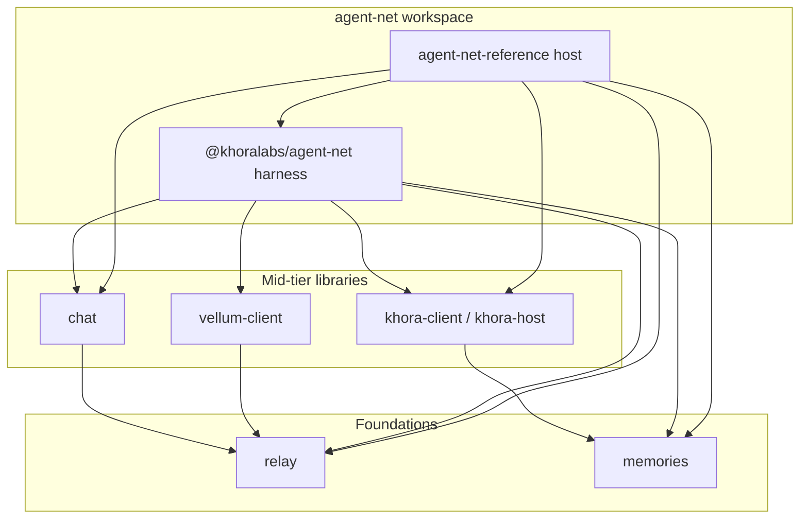

# Primary package dependency graph

How `@khoralabs/agent-net` (harness) and the reference host relate to the primary Khora stack packages. Versions are intentionally omitted; treat this as a structural map for upgrade planning.

## Layers



Two independent foundation stacks meet only at agent-net:

| Stack | Foundation | Mid-tier | Typical role |
| --- | --- | --- | --- |
| Transport / negotiate | `relay` | `chat`, `vellum-client` | Signed channels, MLS, chat ledger, Vellum pool uplink |
| Social / memory | `memories` | `khora-client`, `khora-host` | Memory service + host social graph |

Within agent-net there is a further split:

| Layer | Package | Owns |
| --- | --- | --- |
| **Client / control plane** | `@khoralabs/agent-net` (harness) | Calls remote APIs; composes agents, pool, social, memories tools, negotiate |
| **Host / process wiring** | `@khoralabs/agent-net-reference` | Embeds servers (relay, chat HTTP, memories HTTP, khora-host); runs orchestrator + CLIs that consume the harness |

---

## Package-by-package usage

### `relay`

**Depends on (among primaries):** none.

**Used by:** `chat` (peer/crypto), `vellum-client` (client/MLS/contracts), harness, reference.

| Agent-net layer | Import surface | How it is used |
| --- | --- | --- |
| Harness | `relay/client`, `relay/crypto` | Negotiate/Vellum uplink via `RelayClient`; DID/ed25519 helpers for chat signers |
| Reference | `relay/server` | Runs the in-process relay the harness points at (`RELAY_BASE_URL`) |

**Direct vs wiring:** harness = direct client; reference = server wiring.

---

### `memories` (`memories-node`, `memories-service`, `memories-agents`, …)

**Depends on (among primaries):** none.

**Used by:** `khora-host` / host bootstrap paths, harness, reference.

| Agent-net layer | Import surface | How it is used |
| --- | --- | --- |
| Harness | `memories-service/client` (+ agent helpers), `memories-node` (+ helpers/ontology), `memories-agents/tools` (+ integrator wire) | Remote memory client, search/write tools, turn memory sources, toolkits |
| Reference | `memories-service` (http/auth/sqlite), `memories-node/sqlite`, telemetry helpers | Embeds local memories HTTP + SQLite; shared stack for khora host search |

**Catalog-only today (not imported by harness/reference code):** `memories-otel`, `memories-spec`, `memories-react-graph` (optional host telemetry / docs).

**Direct vs wiring:** harness = direct service client + node helpers; reference = service host wiring (+ node sqlite prep).

---

### `chat`

**Depends on (among primaries):** `relay` (crypto / optional peer).

**Used by:** harness, reference.

| Agent-net layer | Import surface | How it is used |
| --- | --- | --- |
| Harness | `chat`, `chat/http/client`, `chat/persistence` | Signed messaging: thread/post client, writers, crypto adapters |
| Reference | `chat/http` | Embeds chat HTTP (+ WS fanout) for the harness to call |

**Direct vs wiring:** harness = HTTP client; reference = HTTP server.

---

### `vellum` (`vellum-client`)

**Depends on (among primaries):** `relay`.

**Used by:** harness (direct); reference only via harness re-exports.

| Agent-net layer | Import surface | How it is used |
| --- | --- | --- |
| Harness | `vellum-client`, `vellum-client/pool`, `vellum-client/pool/host` | `VellumChain` / NBC negotiate, shared uplink pool, attachment dirs, handles |
| Reference | (via `@khoralabs/agent-net`) | Opens/disconnects Vellum through harness APIs — does not import vellum-client directly |

**Direct vs wiring:** harness = direct; reference = transitive through harness.

---

### `khora` (`khora-client`, `khora-host`)

**Depends on (among primaries):** `memories` (host/search stack).

**Used by:** harness (`khora-client`), reference (`khora-host` + thin client transport types).

| Agent-net layer | Import surface | How it is used |
| --- | --- | --- |
| Harness | `khora-client`, `khora-client/transport` | Social tools, posts/profiles/inbox, per-agent clients, pool inbox |
| Reference | `khora-host` (+ bootstrap/sqlite/http), `khora-client/transport` | Bootstraps and serves the host; harness talks to it as a remote |

**Direct vs wiring:** harness = client only; reference = host process wiring.

---

### `@khoralabs/agent-net` (harness) and reference

```
reference orchestrator
  ├─ wires servers: khora-host, memories-service, relay/server, chat/http
  └─ CLIs import harness → which calls clients:
        khora-client, chat HTTP client, memories-service client,
        relay/client + vellum-client, memories-node, memories-agents
```

| Consumer | Role |
| --- | --- |
| Reference CLIs / workflows | Import `@khoralabs/agent-net` (+ `/swarm`, `/ai-sdk`, …) for pool, agents, negotiate, durable turn helpers |
| Harness | Does **not** host relay/chat/memories/khora; assumes base URLs / tokens from the environment or host |

---

## Upgrade cascade map

Lower-level SemVer bumps do **not** always force the same bump one layer up. Propagation depends on (1) whether the higher package’s **public API** changes, (2) whether it **re-exports** or only **consumes** privately, and (3) whether the break is at a **hosted process** boundary (reference) vs the **published harness**.

### Legend

| Bump | Meaning here |
| --- | --- |
| **none** | Consume via existing range / lock refresh only |
| **patch** | Compatible fix; no intentional API change at this layer |
| **minor** | Additive adoption (new paths, error classes, discovery) or expanded behavior |
| **major** | Breaking for this layer’s callers or required wire contract |

### Foundations → mid-tier

| Change in lower package | Typical mid-tier response | Why |
| --- | --- | --- |
| **relay** patch (internal bugfix, types unchanged) | **chat** / **vellum**: none–patch | Peer/catalog refresh; no public API change |
| **relay** minor (new exports: path map, `RelayClientError`, additive health fields) | **vellum**: minor if it adopts or re-exports; **chat**: often none–patch (crypto-only usage) | Chat barely touches relay HTTP; vellum’s session fabric sits on `RelayClient` |
| **relay** major / breaking wire (e.g. health body shape, removed routes) | **vellum**: major if callers observe relay HTTP/errors; **chat**: none–patch unless crypto/API break | Reference host that serves relay feels the break even if chat’s published API does not |
| **memories** patch | **khora**: none–patch | Host still talks the same service client |
| **memories** minor (well-known discovery, error codes, shared paths) | **khora**: minor when host adopts discovery/codes; else patch | Adoption is intentional; unused additive APIs need no khora bump |
| **memories** major (auth scheme, storage contract, removed routes) | **khora**: major | Host embeds and configures the service |

### Mid-tier → harness (`@khoralabs/agent-net`)

| Change in mid-tier | Typical harness response | Why |
| --- | --- | --- |
| **chat** patch | none–patch | Client-compatible |
| **chat** minor (`ChatHttpClientError`, path map, health version) | **minor** if harness catches/branches on new errors or paths; else patch | Social/message code is the adoption surface |
| **chat** major (auth, route rename) | **major** | Harness posts/threads are a public capability |
| **vellum-client** patch | none–patch | |
| **vellum-client** minor (control path/error/health helpers) | **minor** if negotiate/NBC adopts; else patch | Reference rarely imports vellum directly |
| **vellum-client** major | **major** | Negotiate is a harness feature |
| **khora-client** patch | none–patch | |
| **khora-client** minor (`discoverHost`, client errors, path map) | **minor** when social/inbox/tools adopt | High leverage adoption surface in harness |
| **khora-client** major | **major** | Social fabric is core API |
| **khora-host** only (no client change) | **none** on harness | Harness does not depend on `khora-host`; reference absorbs host bumps |

### Memories / relay → harness (direct edges)

Harness also depends on **relay** and **memories-*** directly (not only via mid-tier).

| Lower change | Harness | Notes |
| --- | --- | --- |
| relay patch | none–patch | Crypto + `RelayClient` |
| relay minor (client errors / paths) | minor if negotiate adopts shared errors/paths | Can ship without waiting on vellum if types remain compatible |
| relay breaking wire | major **or** reference-only fix | If only the **hosted** relay health/probe breaks, reference may change without a harness major |
| memories patch | none–patch | |
| memories minor (discovery, codes, paths) | minor when tools/client adopt | Parallel to khora adoption; both can adopt the same memories release |
| memories major | major | Memory tools and turn sources are harness API |

### Harness → reference

| Harness change | Reference | Why |
| --- | --- | --- |
| patch | none–patch | Lock/catalog refresh |
| minor (new optional APIs) | none–minor | CLIs/workflows adopt when useful |
| major | major (app) | Orchestrator/CLIs are the product surface; not always published like the library |

Reference also depends **directly** on server packages (`relay/server`, `chat/http`, `memories-service` host, `khora-host`). A **foundation or mid-tier host break** can force a **reference** change **without** a harness SemVer bump (example: relay health JSON vs plain text only affects whatever probes health in the host process).

### Non-obvious cases

| Lower change | Easy to misread | Actual cascade |
| --- | --- | --- |
| New shared HTTP path maps / error codes (additive) | “Everything must major” | Usually **minor** at the layer that **adopts**; layers that only bump the catalog can stay **patch** |
| Health `{ ok: true }` → `{ ok: true, version }` | Breaking for all dependents | Breaking only for **health consumers**; libraries that never call `/health` may take a **patch** dep bump |
| New client error class with `status`/`code` | Forces all catch sites to rewrite | Additive if old `Error` / domain-not-found paths remain; **minor** when call sites start branching on `code` |
| Well-known discovery (memories/khora) | Required for all hosts | Optional until something stops hard-coding base URLs; **minor** at adopter, **none** elsewhere |
| `khora-host` bootstrap change | Harness bump | **Reference-only** unless `khora-client` wire changes |
| `vellum` control HTTP hardening | agent-net must wait on chat | **Independent** of chat; only relay → vellum → harness/reference negotiate path |
| Publishing mid-tier before foundation | “Faster” | Forces a **second** catalog churn; publish foundations first, then mid-tier, then agent-net |

### Suggested publish order (structural)

```text
Wave 1 (parallel):  relay, memories
Wave 2 (parallel):  chat + vellum (after relay), khora (after memories)
Wave 3:             agent-net harness catalog + adoption, then reference host wiring
```

At each wave: bump and publish the lower package, refresh the higher package’s catalog/lock, **adopt** new path/error/discovery APIs where that layer has call sites, then decide SemVer from **this layer’s public contract**, not from the lower package’s bump label alone.

---

## Quick reference: who feels which primary

| Primary | Harness feels it? | Reference feels it? |
| --- | --- | --- |
| relay | Yes (client/crypto) | Yes (server) |
| memories | Yes (client/node/agents) | Yes (HTTP+sqlite host) |
| chat | Yes (HTTP client) | Yes (HTTP server) |
| vellum-client | Yes (negotiate/pool) | Indirect (via harness) |
| khora-client | Yes (social/inbox) | Thin (transport types) |
| khora-host | No | Yes (host process) |
